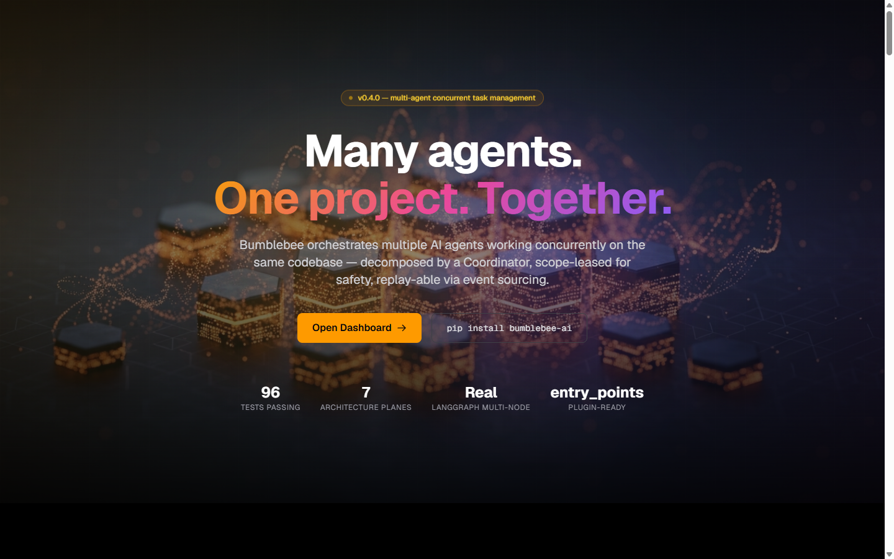
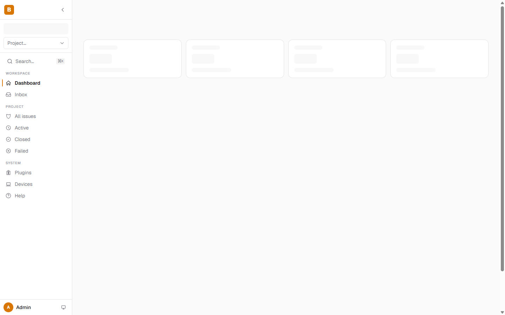
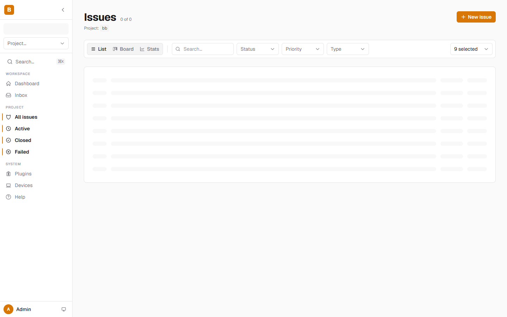
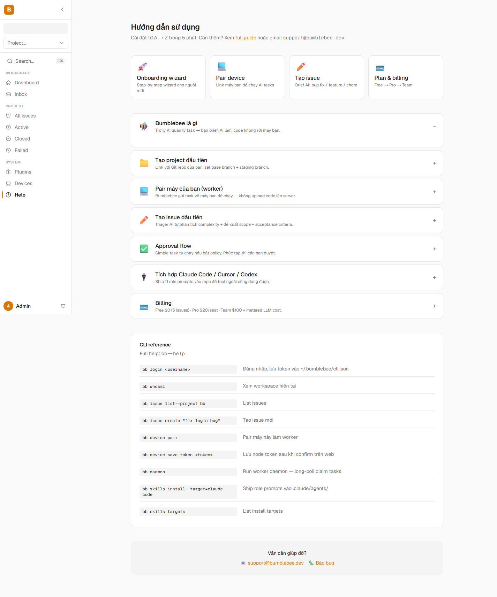
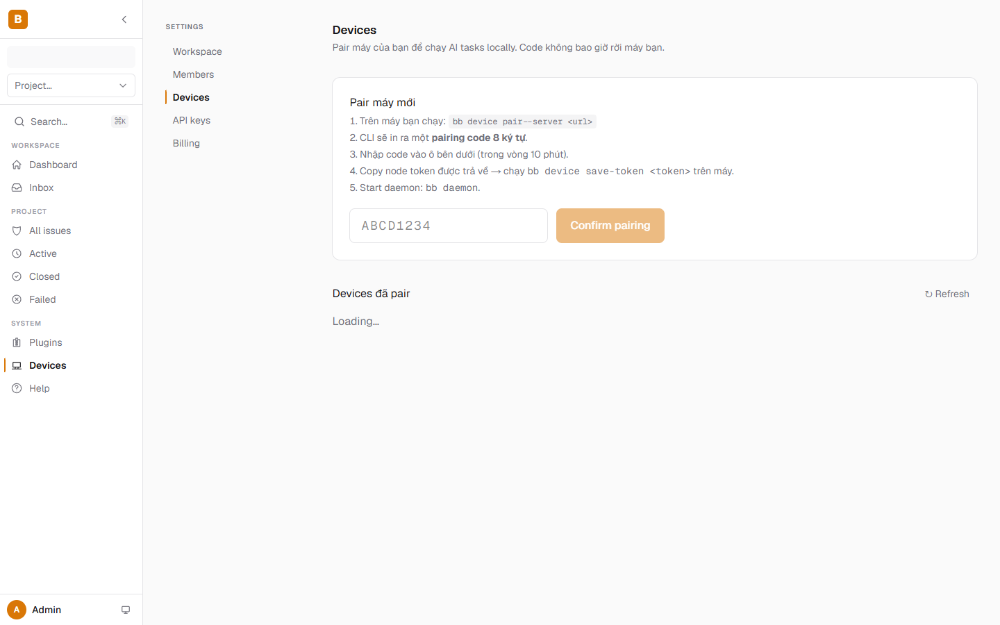
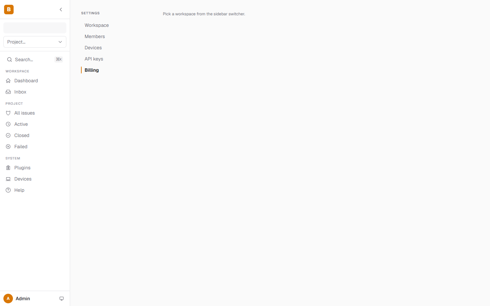
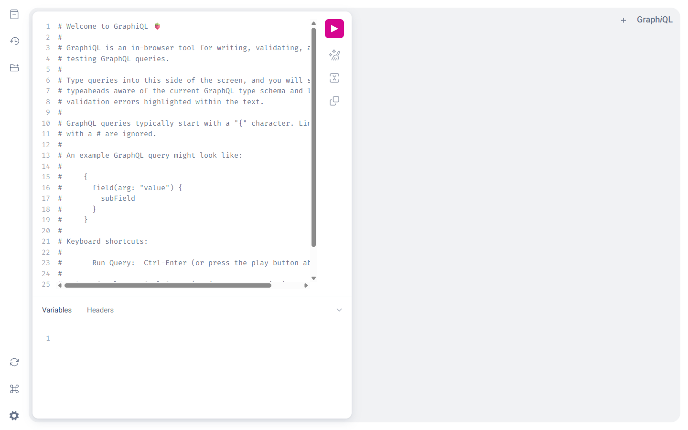

# Bumblebee — Walkthrough đầy đủ với hình ảnh

Tour tất cả các feature, có screenshot, chụp khi server đang chạy live. Dùng để onboard user mới hoặc làm demo.

> Chạy: `bb server` + `cd web && npm run dev` → mở `http://localhost:3000`

---

## 1. Landing page — `/`



**Có gì:**
- Hero: "Many agents. One project. Together."
- 4 metric pills: tests passing · architecture planes · langgraph multi-node · entry points
- CTA: **Open Dashboard** + **Install bumblebee-ai**
- Background: 3D animation với khung scenery + chuyển động framer-motion

**Dùng cho:** Marketing page cho người chưa đăng ký.

---

## 2. Đăng ký — `/register`


**Form fields:** email · username · password · full name · (optional) workspace name.

**Behavior:** Submit → server tạo User + auto-tạo Workspace + WorkspaceMember role=OWNER → trả JWT → web lưu vào localStorage → redirect `/onboard`.

**Mutation tương ứng (GraphQL):**
```graphql
mutation Signup($input: SignupInput!) {
  signup(input: $input) {
    accessToken
    user { id username email }
    workspace { id name slug plan role }
  }
}
```

---

## 3. Đăng nhập — `/login`


**Form:** username + password. Có "Sign in with Google" button (OAuth Authlib).

**Mutation:**
```graphql
mutation Login($input: LoginInput!) {
  login(input: $input) { accessToken user { username } workspace { name slug plan } }
}
```

CLI equivalent: `bb login <username>` → cache token vào `~/.bumblebee/cli.json`.

---

## 4. Pricing — `/pricing`


3 plans:

| Plan | Giá | Issues active | LLM | Workspaces |
|---|---|---|---|---|
| **Free** | $0 | 5 | $1/mo | 1 |
| **Pro** | $20/seat/mo | ∞ | $20/seat/mo | 5 |
| **Team** | $100 + LLM passthrough | ∞ | Metered | ∞ |

Click "Upgrade to Pro" → Stripe Checkout session → thẻ test → redirect về `/settings/billing?status=success`.

Backend route GraphQL:
```graphql
mutation CreateCheckoutSession($input: CheckoutSessionInput!) {
  createCheckoutSession(input: $input) { sessionId url }
}
```

---

## 5. Dashboard — `/dashboard`



**Sidebar có 3 sections:**
- **Workspace**: Dashboard · Inbox
- **Project**: All issues · Active · Closed · Failed (mỗi cái có badge count)
- **System**: Plugins · **Devices** ⭐ (mới) · **Help** ⭐ (mới)

**Project switcher** ở trên (combobox).
**Workspace badge** ở trên cùng (B = "Bumblebee").
**User avatar** "Admin" ở dưới cùng.

Main panel: stat cards (4 widgets) — issues open, sessions running, LLM spend tháng này, recent activity.

---

## 6. Issues — `/issues`



**Header:** "Issues 0 of 0" + project chip + **+ New issue** button.

**3 view tabs:** List · Board (kanban) · Stats (charts).

**Filters:** search box + Status dropdown + Priority dropdown + Type dropdown + "9 selected" multi-select.

**Empty state:** skeleton rows trong khi data load qua GraphQL `issues(projectId: $pid, limit: 100)`.

Click một issue → modal/detail page với:
- AI Summary + Suggested Solution + Acceptance Criteria
- **Approve** button (GraphQL `approveIssue` mutation)
- **Trigger Workflow** (REST `/api/workflow-runs/trigger` — auto chọn workflow theo complexity)
- Activity timeline (WebSocket realtime feed events)

---

## 7. Help (Hướng dẫn trong app) — `/help` ⭐ MỚI



**Toàn trang:**

1. **4 quick-link cards** ở trên: Onboarding wizard · Pair device · Tạo issue · Plan & billing
2. **Accordion 7 sections** (mở "Bumblebee là gì" mặc định):
   - Bumblebee là gì
   - Tạo project đầu tiên
   - Pair máy của bạn (worker)
   - Tạo issue đầu tiên
   - Approval flow
   - Tích hợp Claude Code / Cursor / Codex
   - Billing (có bảng so sánh 3 plans)
3. **CLI reference table** 9 commands: `bb login` · `bb whoami` · `bb issue list/create` · `bb device pair/save-token` · `bb daemon` · `bb skills install/targets`
4. **Footer**: support@bumblebee.dev + GitHub issues link

→ User mới chỉ cần xem trang này là biết dùng. Không cần leave app.

---

## 8. Settings → Devices — `/settings/devices` ⭐ MỚI (UI critical vừa fill)



**Setting nav** (left): Workspace · Members · **Devices** (active) · API keys · Billing.

**Pair card:**
- Tiêu đề "Pair máy mới"
- 5 bước instructions (Vietnamese)
- Input nhập pairing code 8 ký tự (`ABCD1234`) — uppercase + monospace + pattern validation
- **Confirm pairing** button → gọi GraphQL `devicePairConfirm(code: $code)` → trả về `nodeToken`
- Sau khi confirm: hiện token trong success box màu xanh + copy-to-clipboard button (chỉ hiển thị 1 lần)

**Devices list** (dưới):
- Empty state: "Chưa có device nào. Pair máy đầu tiên ở trên."
- Có data: table với Name · Status (status dot xanh/vàng/xám) · Capabilities (chip tags) · Platform · Last seen (relative time)

GraphQL queries dùng: `useNodes()` + `useDevicePairConfirm()` từ `web/src/lib/graphql-hooks.ts`.

---

## 9. Billing — `/settings/billing`



Trang billing đầy đủ:
- Plan hiện tại + badge plan tier
- LLM spend tháng này / budget cap (progress bar)
- Invoice list (Stripe API)
- **Upgrade plan** / **Cancel subscription** buttons
- Payment method (last4)

Webhook handlers (REST `/api/stripe/webhook`) cập nhật state realtime — khi user thanh toán xong, web tự reload tier mới.

---

## 10. Onboarding wizard — `/onboard`


Wizard 4-step:
1. **Workspace name** — đặt tên workspace
2. **Invite team** — gửi invite emails (optional)
3. **First issue** — chọn template (Bug · Feature · Chore) hoặc tạo custom
4. **Trigger workflow** — pick workflow + chạy

Mỗi step có Skip + Next. Lưu state vào localStorage để resume.

---

## 11. GraphQL playground — `http://localhost:8000/graphql`



**Cho dev:** Strawberry mặc định mount **GraphiQL** ở `/graphql` khi mở browser. Auto-complete + schema introspection + variables/headers panel.

Thử query:
```graphql
{
  me { id name slug plan }
  projects { id key slug name stagingBranch }
  issues(limit: 5) { number title status complexity }
  nodes { name status capabilities lastHeartbeatAt }
}
```

Mutations available: `signup`, `login`, `createApiKey`, `createIssue`, `updateIssue`, `approveIssue`, `devicePairRequest`, `devicePairConfirm`, `createCheckoutSession`.

---

## End-to-end flow — full vision walkthrough

> User journey từ lúc đăng ký đến lúc AI fix bug trong repo.

### Bước 1 — Đăng ký + setup
```bash
# Cài CLI
pip install bumblebee-ai          # hoặc clone + pip install -e .

# Mở web → Register (workspace tự tạo)
open http://localhost:3000/register
```

### Bước 2 — Tạo project
Web → Dashboard → **+ New Project** → điền tên + repo path + base/staging branch.

### Bước 3 — Pair máy bạn
```bash
# Trên máy có repo
bb device pair --server http://localhost:8000 --workspace your-slug
# CLI in ra: "Pairing code: ABCD1234"
```

Web → Sidebar **Devices** → nhập `ABCD1234` → Confirm → copy `nt_xxxxx` token.

```bash
bb device save-token nt_xxxxx
bb daemon                          # daemon đang chờ tasks
```

### Bước 4 — Ship role prompts vào repo (optional)
```bash
cd /path/to/your/repo
bb skills install --target=claude-code   # → .claude/agents/bumblebee-*.md
```

### Bước 5 — Tạo issue
Web → **+ New Issue** → "Login form lỗi khi nhập email viết hoa".

Sau 10-30s, Triager:
- Set `complexity = simple`
- Set `ai_summary`, `ai_suggested_solution`, `scope_hints = ["src/auth/*.ts"]`
- Status → `TRIAGED`

### Bước 6 — Approve + Run
Click issue → đọc Suggested Solution → click **Approve** (status → `APPROVED`) → click **Trigger Workflow**.

Bumblebee chọn `simple-fix-flow` (per H1 router). Approval gate (H2) verify → cho phép dispatch.

Worker daemon trên máy bạn pull task → chạy command (Claude CLI / git / tests) → stream events `task_started`, `task_log` (per line stdout), `task_completed`.

### Bước 7 — Theo dõi
Web → Issue detail → Activity tab → xem timeline realtime.

CLI:
```bash
bb issue list --status in_progress
```

Khi xong: status `DEVELOPED` → enqueue merge_to_staging task → daemon merge sang `stg` branch → enqueue e2e/smoke → status chuyển `TESTING` → `STAGING` → khi bạn promote → `RELEASED`.

---

## Verify mọi thứ đang chạy

```bash
# API
curl http://localhost:8000/health/         # → 200
curl -X POST http://localhost:8000/graphql \
  -H "Content-Type: application/json" \
  -d '{"query":"{ __schema { queryType { name } } }"}'

# Web
curl http://localhost:3000                  # → 200

# Stripe + DB:
python scripts/test-stripe-flow.py          # 11/11 steps pass
python scripts/test-vision-flow.py          # 6/6 steps pass
python scripts/test-graphql-smoke.py        # all queries resolve
```

---

## Tips for demo

1. **Mở 2 terminal**: 1 chạy `uvicorn`, 1 chạy `npm run dev`. Tab thứ 3 cho `bb daemon`.
2. **Project default key `BB`** đã seed sẵn — có 3 issues mẫu (BB-1, BB-2, BB-3) để demo Triager.
3. **GraphiQL** ở `/graphql` rất tốt để demo schema introspection cho dev khách hàng.
4. **Help page** dùng để onboard người mới không kỹ thuật — accordion + CLI reference, không cần leave app.
5. **Devices page** là entry point critical — nếu user không pair được máy thì không chạy được task. Verify nó hoạt động đầu tiên.

---

**Cập nhật cuối:** 2026-05-23 (live capture với servers chạy thật)
