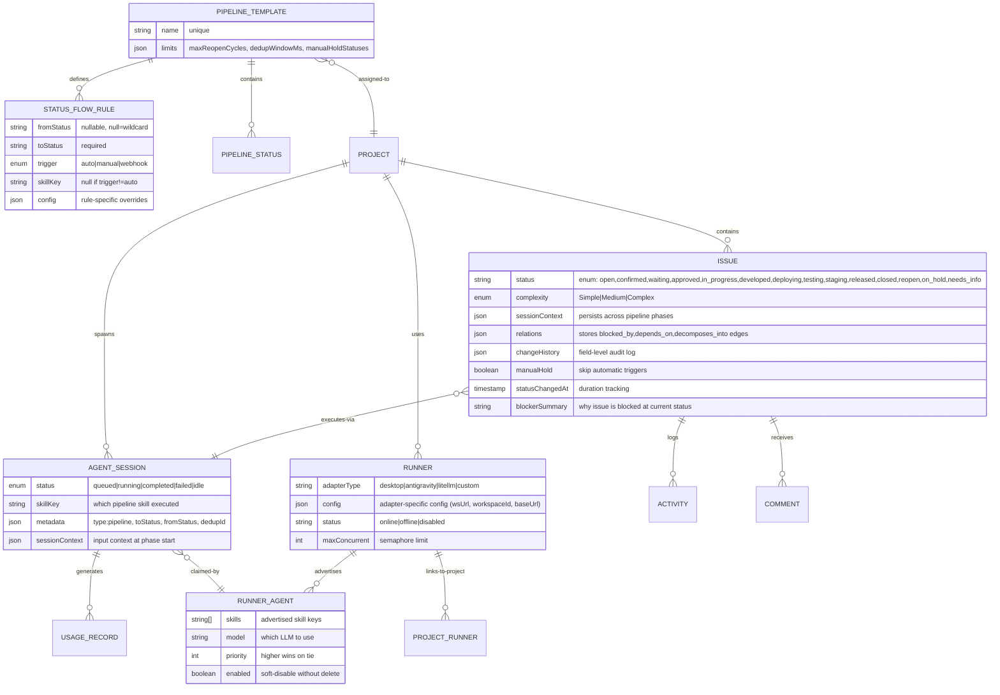

# Jarvis Pipeline Architecture Analysis for Bumblebee Go Rewrite

**Date:** 2026-05-13  
**Scope:** Data model, status machine, runner interface, lifecycle hooks, queue/worker protocol, and architectural patterns from Jarvis task-management pipeline.  
**Context:** Informing phase 1 Go (chi+sqlc+pgx) + Postgres rebuild of Bumblebee task management (agent layer deferred to phase 2-3).

---

## 1. Data Model (Mermaid ER)



---

## 2. Status Machine (Full State Diagram)

```
HAPPY PATH (Simple/Medium):
  open --[forge-triage]--> confirmed --[forge-plan]--> approved
    --[forge-code]--> in_progress --[auto-build,auto-test]--> deploying
    --[auto-transition]--> testing --[forge-test]--> staging
    --[human-approve]--> released --[forge-release]--> closed

HAPPY PATH (Complex):
  open --[forge-triage]--> confirmed --[forge-plan]--> waiting
    --[human-approve]--> approved --[forge-code]--> in_progress
    --[auto-review,auto-commit]--> developed --[forge-review]-->
    deploying --[auto-transition]--> testing --[forge-test]--> staging
    --[human-approve]--> released --[forge-release]--> closed

FAILURE RECOVERY (code):
  in_progress, developed, deploying --[test/review fail]--> reopen
    --[forge-fix]--> in_progress (Simple/Med) OR developed (Complex)
  [reopen cycle counter: auto-fix max 5 cycles, then manualHold]

FAILURE RECOVERY (infra):
  deploying --[server-deploy-fail]--> on_hold
    --[human-fix + manual-retrigger]--> deploying

DEPENDENCY GATES:
  Any status: clarified, approved, released, closed
    --[dependencies not done]--> paused (implicit hold)
    --[dependencies resolve]--> auto-retry

DECOMPOSITION PARENT BLOCK:
  waiting --[children not ready]--> paused-at-waiting
  approved --[all children staged]--> auto-deploying

DECOMPOSITION CHILD RELEASE GATE:
  released --[parent not released]--> gated

SPECIAL STATUSES (reachable from anywhere):
  needs_info (user clarification)
  on_hold (manual pause)
```

**Key Rules:**
- Forward progression enforced (draft < open < confirmed < ... < closed)
- `reopen`, `needs_info`, `on_hold` bypass order check
- Backward transitions only from these special statuses
- `statusChangedAt` denormalized for block-duration queries
- `blockerSummary` auto-populated per status if caller doesn't set
- No transition allowed if `manualHold=true` (auto-trigger only)

---

## 3. Runner Interface Contract

**Go Equivalent (proposed interface + context methods):**

```go
// RunnerAdapter is the contract for dispatching work to a backend execution system.
type RunnerAdapter interface {
  // Type returns the adapter type identifier (e.g., "desktop", "antigravity").
  Type() string
  
  // Health returns the current health state. Must NOT open transport connections.
  // Used by UI status panels only; not gating dispatch.
  Health(ctx context.Context) (*HealthState, error)
  
  // CanHandle returns true if this adapter can execute the skill (and optional model).
  // Called per-dispatch for adapter selection. Must be fast.
  CanHandle(ctx context.Context, skill string, model *string) (bool, error)
  
  // Dispatch runs the job. Returns:
  //   - dispatched=true if the backend accepted the work (async execution).
  //   - dispatched=false if the backend rejected it (queue full, no agent available).
  //   - error != nil if the backend failed (classified into transient|quota|unsupported|fatal).
  //   - For synchronous AI calls (LiteLLM style), dispatched=true + text/usage populated.
  Dispatch(ctx context.Context, job *PipelineJob) (*DispatchResult, error)
  
  // Cancel attempts to stop an in-flight job. Best-effort; some backends can only mark abandoned.
  Cancel(ctx context.Context, jobID string) error
}

type HealthState struct {
  OK     bool
  Detail string // why if not OK
}

type PipelineJob struct {
  ID            string                 // job ID for dedup/cancel
  IssueID       string                 // issue documentId
  SkillKey      string                 // which pipeline skill
  ProjectID     string                 // project context
  Model         string                 // which LLM to use
  SystemPrompt  string                 // task instructions
  Messages      []map[string]string    // conversation history
  MaxTokens     int                    // response limit
  Config        map[string]interface{} // rule-specific overrides (timeoutMin, etc)
  Metadata      map[string]interface{} // context (type, toStatus, fromStatus)
}

type DispatchResult struct {
  Dispatched bool       // did backend accept the work?
  JobID      string     // backend job ID if dispatched
  Text       string     // response text (sync AI calls only)
  Usage      *TokenUsage
  Error      *AdapterError // if dispatched=false && error != nil
}

type TokenUsage struct {
  InputTokens  int
  OutputTokens int
}

type AdapterError struct {
  Class   ErrorClass // transient|quota|unsupported|fatal
  Message string
  Cause   error
}

type ErrorClass string

const (
  ErrorClassTransient   ErrorClass = "transient"   // retry-eligible (network, 5xx)
  ErrorClassQuota       ErrorClass = "quota"       // rate-limited; mark runner depleted
  ErrorClassUnsupported ErrorClass = "unsupported" // adapter can't do this job; fallback
  ErrorClassFatal       ErrorClass = "fatal"       // bug/misconfiguration; park issue
)
```

**Key Patterns:**
1. All adapters are **stateless wrappers** — persistent state (queues, sessions, depletions) lives in core services.
2. `Health()` is informational (no gating); dispatch result is authoritative.
3. Error classification drives orchestrator retry logic (transient = retry, quota = deplete runner, fatal = park issue).
4. Sync AI calls return `text + usage` directly from `Dispatch()`.
5. Async backends (desktop, Antigravity) return `jobId` and the orchestrator polls/listens for completion.

---

## 4. Lifecycle Hooks Pattern (Strapi → Go)

**Strapi uses `db.lifecycles.subscribe()` to react to data mutations. Go equivalent: database triggers + event publishing.**

### Hooks Fired on Issue Status Change

| Hook | Strapi Code | Go Equivalent | Responsibilities |
|------|-------------|---------------|------------------|
| **beforeUpdate** | issue-lifecycle.ts:118 | TX hook (before COMMIT) | Validate transition allowed, set `statusChangedAt`, auto-populate `blockerSummary` |
| **afterUpdate** | issue-lifecycle.ts:155 | TX event (after COMMIT) | Create Activity records, dispatch webhook, embed issue, recompute rolling stats, **trigger pipeline orchestrator** |

### Critical afterUpdate Side Effects (must be implemented in Go):

```go
// Pseudo-code for all side effects on issue status change
func onIssueStatusChange(tx *sql.Tx, issue Issue, change FieldChange) error {
  // 1. Record change history (append to changeHistory JSON)
  appendChangeHistory(tx, issue, change)
  
  // 2. Create Activity record for audit trail
  createActivity(tx, issue.ID, "status_change", change.From, change.To)
  
  // 3. Send webhook to external systems (if status changes)
  if change.Field == "status" {
    sendWebhook(issue.ID, change) // async, fire-and-forget
  }
  
  // 4. Update embeddings in vector DB (re-embed on status change)
  embedIssue(issue) // async
  
  // 5. Recompute project rolling stats (burndown, velocity)
  recomputeRollingStats(tx, issue.ProjectID) // async
  
  // 6. Pipeline orchestrator: CORE TRIGGER
  //    Reads issue, project, pipeline template, and dispatches next skill
  if err := triggerPipelineStep(tx, issue.ID, change.From, change.To); err != nil {
    log.Warn("pipeline trigger failed", err)
  }
  
  // 7. Status-specific side effects:
  if change.To == "confirmed" {
    // Check if should auto-skip to 'clarified' (Simple issue, autoClarify enabled)
    // Orchestrator handles this via shouldSkipStep() logic
  }
  
  if change.To == "deploying" {
    // Auto-transition deploying → testing (staging is sole test env)
    updateIssue(tx, issue.ID, map[string]interface{}{"status": "testing"})
  }
  
  if change.To == "approved" && change.From == "waiting" {
    // Decomposition: cascade approval to all decomp-parent children
    cascadeApprovalToChildren(tx, issue)
  }
  
  if strings.Contains(statusDoneEnough(change.To), "true") {
    // Unblock dependent issues (blocked_by edge: re-trigger their pipeline)
    unblockDependents(tx, issue.ID)
  }
  
  if change.To == "closed" {
    // Delete queued sessions (no point running them after close)
    deleteQueuedSessions(tx, issue.ID)
    
    // Cascade close to all decomp children (abort running sessions first)
    cascadeCloseToChildren(tx, issue.ID)
  }
  
  if change.To == "developed" && change.From == "reopen" {
    // Capture CI fix success pattern for ML feedback
    storeCIFixPattern(tx, issue.ProjectID, issue.ID)
  }
  
  if contains([]string{"developed", "closed"}, change.To) {
    // Embed sessionContext in vector DB for retrieval
    embedSessionContext(issue.ID)
  }
  
  return nil
}
```

### Transition Validation (beforeUpdate)

```go
// isTransitionAllowed enforces the status machine rules
func isTransitionAllowed(from, to string) bool {
  const (
    StatusDraft = iota
    StatusOpen
    StatusConfirmed
    StatusClarified
    StatusWaiting
    StatusApproved
    StatusInProgress
    StatusDeveloped
    StatusDeploying
    StatusTesting
    StatusStaging
    StatusReleased
    StatusClosed
  )
  
  // Special statuses always reachable from anywhere
  backwardAllow := map[string][]string{
    "reopen":     {"testing", "staging", "released", "closed", "developed"},
    "needs_info": {/* all statuses */},
    "on_hold":    {/* all statuses */},
    "draft":      {"open"},
  }
  
  if from == to {
    return true
  }
  if _, ok := backwardAllow[to]; ok && contains(backwardAllow[to], from) {
    return true
  }
  if _, ok := backwardAllow[from]; ok {
    // Leaving a special status is always allowed
    return true
  }
  
  // Otherwise, only forward progression allowed
  statusOrder := []string{
    "draft", "open", "confirmed", "clarified", "waiting", "approved",
    "in_progress", "developed", "deploying", "testing", "staging", "released", "closed",
  }
  fromIdx := indexOf(statusOrder, from)
  toIdx := indexOf(statusOrder, to)
  
  return fromIdx >= 0 && toIdx >= 0 && toIdx >= fromIdx
}
```

---

## 5. Pipeline Orchestrator (Status Change → Skill Dispatch)

**Entry point:** When issue transitions to new status, orchestrator:
1. Fetches issue + project + pipeline template
2. Loads all `StatusFlowRule` rows for that template
3. Matches rule by (fromStatus, toStatus) pair
4. Applies guard conditions (manualHold, reopen cycle cap, deps resolved, decomp gates)
5. Checks if rule should skip (e.g., Simple + autoClarify enabled)
6. Interprets rule trigger (auto/manual/webhook)
7. If `auto`: creates AgentSession, dispatches via unified runner pool

**Go Implementation Sketch:**

```go
type StatusFlowRule struct {
  DocumentID string
  FromStatus *string // nullable; null = wildcard
  ToStatus   string
  Trigger    string // "auto" | "manual" | "webhook"
  SkillKey   *string
  Config     map[string]interface{}
}

// pickFlowRule finds the best match for (from, to) transition
func pickFlowRule(rules []StatusFlowRule, from, to string) *StatusFlowRule {
  // 1. Exact match on fromStatus (most specific)
  for _, r := range rules {
    if r.ToStatus == to && r.FromStatus != nil && *r.FromStatus == from {
      return &r
    }
  }
  // 2. Wildcard match (fromStatus = null)
  for _, r := range rules {
    if r.ToStatus == to && r.FromStatus == nil {
      return &r
    }
  }
  return nil
}

func triggerPipelineStep(tx *sql.Tx, issueID, fromStatus, toStatus string, isManualRetrigger bool) error {
  issue, err := fetchIssueWithProject(tx, issueID)
  if err != nil {
    return err
  }
  
  template, err := loadPipelineTemplate(tx, issue.ProjectID)
  if err != nil {
    return err
  }
  
  rules, err := loadFlowRules(tx, template.DocumentID)
  if err != nil {
    return err
  }
  
  // Guard: manualHold
  if issue.ManualHold && !isManualRetrigger {
    log.Info("skipping trigger: manualHold set", issue.ID)
    return nil
  }
  
  // Guard: reopen cycle cap
  if !isManualRetrigger && toStatus == "reopen" {
    reopenCount, _ := countReopenCycles(tx, issueID)
    if reopenCount >= maxReopenCycles(template) {
      updateIssue(tx, issueID, map[string]interface{}{
        "manualHold": true,
        "blockerSummary": fmt.Sprintf("Auto-fix stopped — %d reopen cycles", reopenCount),
      })
      return nil
    }
  }
  
  // Guard: dependencies resolved
  doneStatuses := func() *map[string]bool {
    if contains([]string{"released", "closed"}, toStatus) {
      return &map[string]bool{"closed": true}
    }
    return nil
  }()
  if depCheck := checkDependenciesResolved(tx, issueID, doneStatuses); depCheck.Blocked {
    // Paused; will auto-retry when dependencies resolve
    postComment(tx, issueID, fmt.Sprintf("Blocked by: %v", depCheck.PendingIDs), "Pipeline Bot")
    return nil
  }
  
  // Guard: decomp parent at approved → hold until all children staged
  if toStatus == "approved" {
    if children := fetchDecompChildren(tx, issueID); len(children) > 0 {
      allReady := allDecompChildrenReady(children)
      if !allReady {
        log.Info("decomp parent blocked at approved", issueID, len(children))
        return nil
      }
      // All children ready → advance parent to deploying
      return updateIssue(tx, issueID, map[string]interface{}{"status": "deploying"})
    }
  }
  
  // Guard: decomp child at released → block until parent released
  if toStatus == "released" {
    if parent := fetchDecompParent(tx, issueID); parent != nil && parent.Status != "released" && parent.Status != "closed" {
      postComment(tx, issueID, fmt.Sprintf("Release gated: waiting for parent %s", parent.Number), "Pipeline Bot")
      return nil
    }
  }
  
  // Resolve flow rule
  rule := pickFlowRule(rules, fromStatus, toStatus)
  if rule == nil {
    log.Debug("no flow rule matched", issueID, fromStatus, toStatus)
    return nil
  }
  
  // Check skip condition
  if skipCond := rule.Config["skip"]; skipCond != nil {
    if shouldSkipStep(issue, skipCond) {
      nextStatus := rule.Config["nextStatus"]
      log.Info("skipping step", rule.SkillKey, toStatus)
      if nextStatus != nil {
        return updateIssue(tx, issueID, map[string]interface{}{"status": nextStatus})
      }
      return nil
    }
  }
  
  // Dispatch based on trigger type
  switch rule.Trigger {
  case "manual":
    blockerSummary := rule.Config["blockerSummary"]
    return updateIssue(tx, issueID, map[string]interface{}{"blockerSummary": blockerSummary})
    
  case "webhook":
    log.Info("webhook gate", issueID, toStatus)
    return nil
    
  case "auto":
    if rule.SkillKey == nil {
      log.Warn("auto rule with no skillKey", issueID)
      return nil
    }
    
    // Dedup: same toStatus within window
    if !isManualRetrigger {
      recent, _ := fetchRecentSessions(tx, issueID, 60*time.Second)
      for _, sess := range recent {
        if sess.Metadata["type"] == "pipeline" && sess.Metadata["toStatus"] == toStatus {
          log.Info("dup skipped", issueID, toStatus, sess.ID)
          return nil
        }
      }
    }
    
    // Create queued session + dispatch
    session, err := createAgentSession(tx, issue, rule)
    if err != nil {
      return err
    }
    
    return dispatchViaUnifiedPool(tx, session)
  }
  
  return nil
}
```

---

## 6. Queue & Worker Protocol

**Sequence diagram (worker dequeue → execute → webhook callback → auto-advance):**

```
Worker (Desktop/Tauri)                    Backend DB                    Runner Adapter
    │                                         │                               │
    ├──────── GET /api/queue/dequeue ───────>│ (SKIP LOCKED)                  │
    │<──────── AgentSession {id, prompt} ────┤                               │
    │ [LOCK acquired: locked_at = now]        │                               │
    │                                         │                               │
    ├──────── Heartbeat loop (30s) ──────────>│ (keep lock fresh)             │
    │                                         │                               │
    ├──────────────────────── Dispatch Job ──────────────────────────────────>│
    │ (job = issue + prompt + context)       │                               │
    │                                         │                               │
    │<──────────────────────── Streaming Output ─────────────────────────────┤
    │ (token-by-token via /relay-batch)      │                               │
    │                                         │                               │
    │<──────────────────────── Complete/Fail ───────────────────────────────>│
    │                                         │                               │
    ├──────── POST /api/queue/{id}/complete ─>│                               │
    │         with output + sessionContext    │                               │
    │                                         │ [LOCK released]              │
    │                                         ├─ Auto-advance issue status ──>│
    │                                         │  (lifecycle hook fires,       │
    │                                         │   triggers next step)         │
    │                                         │                               │
    │<───────── WS broadcast: queue:idle ────┤                               │
    │ (device picks up next queued session)   │                               │
```

**Key Properties:**
1. **SKIP LOCKED atomic dequeue** — multiple workers race safely for next item
2. **Heartbeat keeps lock fresh** — 30-second intervals; orchestrator assumes hung if >90s silent
3. **Async streaming output** — `/relay-batch` endpoint groups updates into batches
4. **Session persistence** — `sessionContext` JSONB carries phase N result into phase N+1's prompt
5. **Auto-advance on completion** — completion webhook triggers issue status update → lifecycle hook → next pipeline step
6. **Retry logic**:
   - Transient errors: re-enqueue (up to 3 attempts)
   - Quota errors: mark runner depleted, try next runner
   - Fatal errors: move to dead-letter, park issue at `needs_info`

**Go Implementation (worker dequeue loop):**

```go
func (w *Worker) runDequeueLoop(ctx context.Context) {
  ticker := time.NewTicker(5 * time.Second)
  defer ticker.Stop()
  
  for {
    select {
    case <-ctx.Done():
      return
    case <-ticker.C:
      // Attempt atomic dequeue with SKIP LOCKED
      session, err := w.db.DequeueSession(ctx)
      if err != nil || session == nil {
        continue // No session ready; try again next tick
      }
      
      // Launch concurrent worker (respecting maxConcurrent semaphore)
      w.semaphore.Acquire(ctx, 1)
      go func(sess *AgentSession) {
        defer w.semaphore.Release(1)
        w.executeSession(ctx, sess)
      }(session)
    }
  }
}

func (w *Worker) executeSession(ctx context.Context, sess *AgentSession) {
  heartbeatTicker := time.NewTicker(30 * time.Second)
  defer heartbeatTicker.Stop()
  
  // Launch heartbeat loop
  go func() {
    for range heartbeatTicker.C {
      w.db.RefreshSessionLock(ctx, sess.ID)
    }
  }()
  
  // Load issue, project, runner config
  issue, _ := w.db.GetIssue(ctx, sess.IssueID)
  project, _ := w.db.GetProject(ctx, issue.ProjectID)
  runner, _ := w.selectRunnerAdapter(ctx, sess.SkillKey)
  
  // Build job
  job := &PipelineJob{
    ID:           sess.ID,
    IssueID:      sess.IssueID,
    SkillKey:     sess.SkillKey,
    ProjectID:    project.ID,
    Model:        sess.Model,
    SystemPrompt: buildSystemPrompt(issue, sess.SessionContext),
    Messages:     sess.Messages,
  }
  
  // Dispatch
  result, err := runner.Dispatch(ctx, job)
  if err != nil {
    w.handleDispatchError(ctx, sess, err)
    return
  }
  
  if !result.Dispatched {
    // Retry-eligible or queue full; re-enqueue
    w.db.RequeuSession(ctx, sess.ID, 1)
    return
  }
  
  // Async: stream output via relay-batch endpoint
  w.streamSessionOutput(ctx, sess.ID, result.Text)
  
  // On completion: webhook callback
  completionCtx := map[string]interface{}{
    "output":        result.Text,
    "usage":         result.Usage,
    "sessionId":     sess.ID,
    "issueId":       sess.IssueID,
  }
  
  w.db.CompleteSession(ctx, sess.ID, completionCtx)
  
  // Trigger issue status auto-advance (via webhook or direct DB call)
  w.triggerIssueAutoAdvance(ctx, sess)
}
```

---

## 7. Patterns to ADOPT for Go Rewrite

### A. **Template-Driven Pipeline** (NOT hardcoded skills)
- ✅ Define pipeline once in `PipelineTemplate` + `StatusFlowRule` rows
- ✅ Authoring tool: GUI or seed scripts for different lifecycles
- ✅ **Benefit**: support multiple pipelines (support-triage, custom-workflows) without code changes
- ✅ **Implementation**: `StatusFlowRule` table with trigger (auto/manual/webhook), skillKey, and per-rule config bag

### B. **Runner Adapter Interface** (pluggable execution backends)
- ✅ All dispatchers implement same interface: `Health()`, `CanHandle()`, `Dispatch()`, `Cancel()`
- ✅ Adapters are stateless; persistent state in core services
- ✅ **Benefit**: swap runners (desktop CLI → Antigravity → bedrock-direct) without touching orchestrator
- ✅ **Implementation**: interface contract with error classification (transient/quota/unsupported/fatal)

### C. **Session Continuity via JSONB Context**
- ✅ `sessionContext` JSONB field on Issue carries phase N output into phase N+1
- ✅ Each skill reads `sessionContext` preamble before executing
- ✅ **Benefit**: multi-phase coherence without storing full conversation history
- ✅ **Implementation**: compress + store phase summaries (decisions, files modified, errors)

### D. **Deduplication Window** (prevent duplicate dispatch)
- ✅ Same (issue, status) within 60s window → skip re-dispatch
- ✅ Stored in session metadata: `type: pipeline, toStatus, createdAt`
- ✅ **Benefit**: prevent thundering herd on webhook retries
- ✅ **Implementation**: query recent sessions, check Metadata["toStatus"] + createdAt

### E. **Reopen Cycle Cap** (prevent infinite fix loops)
- ✅ Track reopen → deployed/deploying → reopen cycles; cap at 5
- ✅ On cap: set `manualHold=true` + post comment, stop auto-fix
- ✅ **Benefit**: fail fast on hard bugs; manual intervention for 6th+ retry
- ✅ **Implementation**: count DISTINCT cycles in changeHistory where field="status" and status="reopen"

### F. **Dependency Resolution Gate** (decomposition parent → children, blocked_by edges)
- ✅ At clarified/approved/released, check `relations[]` for `blocked_by` edges
- ✅ If any dependency not in doneEnough statuses → park issue with comment
- ✅ Background job: when dependency reaches doneEnough → re-trigger parent pipeline
- ✅ **Benefit**: enforce precedence; auto-retry when unblocked
- ✅ **Implementation**: `relations` as JSON array with `{type, targetDocumentId, reason}`

### G. **Decomposition Parent/Child Coordination** (auto-cascade approval, block/release gates)
- ✅ Parent at waiting → hold until all children ready (staged)
- ✅ Parent approval → cascade to children (draft → approved)
- ✅ Parent close → cascade-close all children (abort sessions first)
- ✅ Child release → gated until parent released (release coordination)
- ✅ **Benefit**: atomic decomposed work (parent acceptance criteria pass all children)
- ✅ **Implementation**: relation edges with type="decomposes_into", isDecompParentRel() helper

### H. **Lifecycle Hooks for Side Effects** (embed, stats, activity, webhook)
- ✅ On status change: activity record, embedding update, rolling-stat recompute, webhook
- ✅ Async (fire-and-forget) for heavy ops; sync for consistency-critical ops
- ✅ **Benefit**: audit trail + ML RAG + metrics + external integrations
- ✅ **Implementation**: transaction commit hook + pub/sub for async work

### I. **Manual Hold Flag** (stop auto-triggers without blocking human)
- ✅ `manualHold=true` → orchestrator skips automatic dispatch
- ✅ Human can still manually trigger via API (isManualRetrigger=true bypasses flag)
- ✅ **Benefit**: pause auto-pipeline for user review without changing status
- ✅ **Implementation**: boolean field + guard in triggerPipelineStep()

### J. **Status Denormalization** (statusChangedAt for block duration queries)
- ✅ On every status change: set `statusChangedAt = now`
- ✅ Execution board queries `now - statusChangedAt` for "blocked X hours"
- ✅ **Benefit**: O(1) duration query without scanning changeHistory
- ✅ **Implementation**: beforeUpdate hook populates field

---

## 8. Patterns to AVOID & Why

| Pattern | Why Avoid | Better Alternative |
|---------|-----------|-------------------|
| **Hardcoded status machine** | Inflexible; adding pipelines requires code changes | Template + StatusFlowRule CRUD |
| **Dispatch orchestrator knows all runners** | Tight coupling; adding runners needs code deploy | Adapter pattern + registry at bootstrap |
| **Session history in database** | Explodes in size; slow to retrieve; noisy context | Compress sessionContext; store phase summaries |
| **Sync dispatch** | Blocks worker; timeouts cascade | Async dispatch + streaming output + callback webhooks |
| **Re-triggerring without dedup** | Thundering herd on retries; duplicate work | SKIP LOCKED dequeue + dedup window (60s) + session reuse |
| **Sync transition validation** | Race conditions on concurrent updates | beforeUpdate hook in transaction; use SKIP LOCKED dequeue |
| **Relation edges in separate table** | Join overhead; harder to denormalize for UX | JSON array on issue: `relations[{type, targetId, reason}]` |
| **Counting cycles in comments** | Slow regex parsing; inaccurate | Track cycles in changeHistory JSON; dedicated cycle counter |
| **Stateful runner object** | Crashes lose pending jobs; hard to restart | Stateless adapter + queue persisted in DB |
| **Manual status bumping** | Bypasses guards (deps, decomp gates, reopen cap) | Enforce via beforeUpdate validation + dedicated manual action API |

---

## 9. Go Implementation Checklist (Phase 1: Task Management)

- [ ] **Data Model**
  - [ ] Issue table (status, complexity, sessionContext, relations[], changeHistory[], manualHold, blockerSummary)
  - [ ] PipelineTemplate table (name, limits JSON)
  - [ ] StatusFlowRule table (fromStatus*, toStatus, trigger, skillKey*, config{})
  - [ ] PipelineStatus lookup (if needed; optional)
  - [ ] AgentSession table (status, skillKey, metadata{}, sessionContext{})
  - [ ] RunnerAdapter table (type, config{}, maxConcurrent, status)
  - [ ] RunnerAgent table (skills[], model, priority, enabled)
  - [ ] Activity table (type, issue_id, actor, field, fromValue, toValue)
  - [ ] Comment table (issue_id, author, body, type)

- [ ] **SQL Schema**
  - [ ] Define migrations (sqlc generate from schema)
  - [ ] Add indexes: issue(status, project_id), session(issue_id, status, created_at), rule(template_id, to_status)
  - [ ] Implement SKIP LOCKED dequeue in Postgres: `SELECT ... FROM queue WHERE locked_at IS NULL OR locked_at < NOW() - INTERVAL '90s' FOR UPDATE SKIP LOCKED`

- [ ] **Orchestrator Service**
  - [ ] `TriggerPipelineStep()` entry point
  - [ ] Guard checks: manualHold, reopen cap, deps resolved, decomp gates, skip condition
  - [ ] Rule picker: pickFlowRule(rules, fromStatus, toStatus)
  - [ ] Dispatch via unified runner pool (adapter selection)
  - [ ] Manual/webhook gate handling

- [ ] **Runner Adapters**
  - [ ] Interface + registry pattern (bootstrap)
  - [ ] Desktop CLI adapter (WebSocket → Claude CLI subprocess)
  - [ ] Antigravity adapter (REST client)
  - [ ] LiteLLM adapter (sync HTTP for AI-only skills)
  - [ ] Error classification (transient, quota, unsupported, fatal)

- [ ] **Lifecycle Hooks**
  - [ ] beforeUpdate: validate transition, set statusChangedAt, populate blockerSummary
  - [ ] afterUpdate: create Activity, embed issue, recompute stats, **trigger orchestrator**, decomp cascades, dependency unblock

- [ ] **Queue & Worker**
  - [ ] Atomic dequeue (SKIP LOCKED)
  - [ ] Heartbeat keep-alive (30s)
  - [ ] Streaming output relay (/relay-batch endpoint)
  - [ ] Completion webhook → auto-advance issue status
  - [ ] Retry logic per error class

- [ ] **Web Routes**
  - [ ] GET /api/v2/projects/{slug}/issues (list, filter by status/type/assignee)
  - [ ] POST /api/v2/projects/{slug}/issues (create)
  - [ ] GET /api/v2/issues/{id} (detail + activity)
  - [ ] PATCH /api/v2/issues/{id} (update status, title, etc.)
  - [ ] POST /api/v2/issues/{id}/comments (add comment)
  - [ ] GET /api/v2/projects/{slug}/issues/tree (hierarchy flat list)
  - [ ] PATCH /api/v2/projects/{slug}/issues/bulk (multi-update)
  - [ ] POST /api/v2/queue/dequeue (worker dequeue)
  - [ ] POST /api/v2/queue/{id}/complete (worker completion)
  - [ ] POST /api/v2/pipeline/{id}/trigger (manual trigger)

---

## 10. Unresolved Questions

1. **Runner discovery at startup**: Should runners self-register via heartbeat, or is DB-seeded configuration sufficient? Jarvis assumes seeding; Go might benefit from dynamic registration to support Tauri + CLI daemon spawning.

2. **Multi-project runner sharing**: Can one runner (e.g., Antigravity workspace) serve multiple projects? Jarvis uses `ProjectRunner` linking; confirm this scales for shared infra.

3. **Embedding backend**: Jarvis uses Qdrant for sessionContext + issue embeddings. Is this required for phase 1, or defer to phase 2 (agent layer)? For v1, skip embeddings; add as phase 2 search optimization.

4. **Webhook delivery guarantees**: Jarvis sends webhooks fire-and-forget. Should we add retry + dead-letter for CI/deploy webhook callbacks? Recommend: add retry envelope for deploy success/fail webhooks; skip for user-notification webhooks.

5. **Session context compression**: Jarvis stores raw sessionContext JSONB (can grow large). Should we implement lossless compression (e.g., snapshot summary on phase complete)? Defer to v1.1; monitor DB growth.

6. **Decomposition scope**: Can decomposed children have their own decomposed children (recursive)? Jarvis doesn't support; recommend: limit to 1 level (parent → children) for v1, extend later if needed.

---

## Summary

**Jarvis patterns that transfer directly to Go (HIGH CONFIDENCE):**
- Template-driven pipeline (StatusFlowRule table + pickFlowRule logic)
- Runner adapter interface + registry
- Session continuity via JSONB context
- Atomic SKIP LOCKED dequeue + heartbeat keep-alive
- Lifecycle hooks on status change (beforeUpdate validation + afterUpdate side effects)
- Reopen cycle cap + manual hold + decomposition gates

**Implementation priorities for phase 1:**
1. Data model + migrations (issue, template, rule, session, activity)
2. Orchestrator service (guard checks, rule resolution, dispatch)
3. Lifecycle hooks (validation + pipeline trigger)
4. Queue + worker loop (SKIP LOCKED dequeue, heartbeat, completion)
5. API routes (CRUD issues, comments, manual triggers)

**Defer to phase 2-3:**
- Embeddings (Qdrant)
- Agent skill definitions + execution
- Advanced decomposition (recursive)
- Webhook retry + dead-letter

**Report saved to:** `D:\Source\Bumblebee-cli\plans\reports\researcher-260513-2210-jarvis-flow-pipeline.md`

---

**Status:** DONE  
**Summary:** Comprehensive analysis of Jarvis pipeline architecture (15 status machine, template-driven rules, runner adapters, lifecycle hooks, queue protocol) with concrete Go patterns, data models, and phase-1 implementation checklist for Bumblebee task management rewrite.
